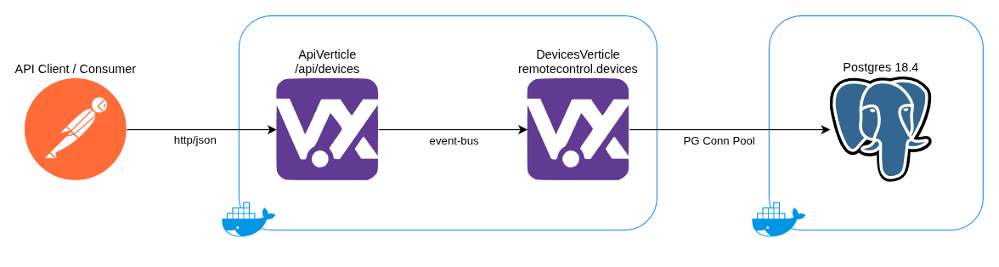
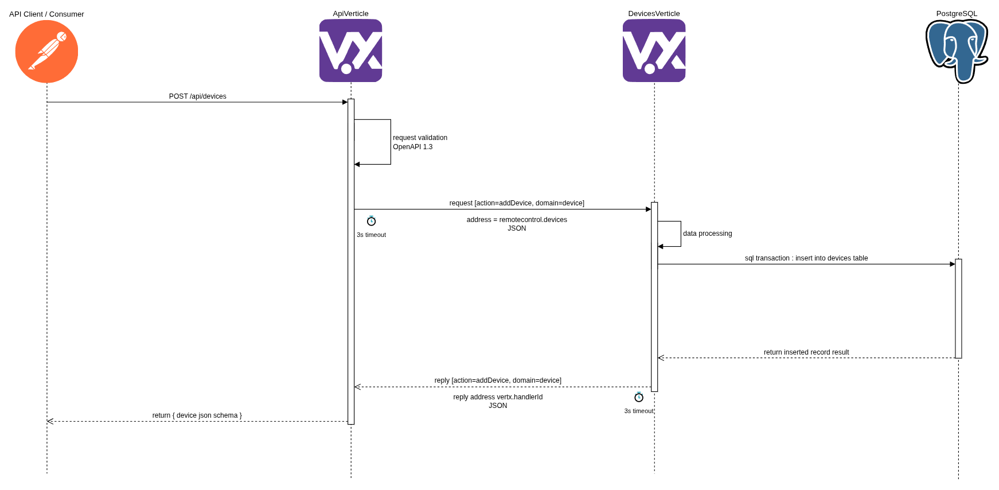

# remote-control-device


A backend service that manages remote control devices via a RESTful API

## Build System

- Java Temurin JDK 25 LTS - programming language
- Apache Maven 3.9.12 - build automation
- Docker 29.5.3 - containers (alpine)
- Editorconfig - source formatting

## Platform

- Eclipse Vert.x 5.1.2
- PostgreSQL 18.4

## Quick Start

1. Clone the git repo

```shell script
git clone git@github.com:george-haddad/remote-control-device.git
```

2. Create a `.env` file in the base repo and put the following values

```plain
# API
NAME=remote-control-device-api
DB_HOST=db
DB_PORT=5432
DB_NAME=remote-control
DB_USER=devicebackend
DB_PASS=Tablet9-Saddling-Undocked-Glance
HTTP_PORT=8080

# DB
POSTGRES_USER=postgres
POSTGRES_PASSWORD=P@ssW0rd12345
POSTGRES_DB=postgres
```

The `DB_PASS` should not be changed as this value is needed to automatically setup the database. This is because the same password is pre-encrypted in the `db/database_setup.sql` script. This is mainly for convenience, in production this wouldn't be the case.

3. Pull the database docker image

```shell script
docker pull postgres:18.4-alpine3.23
```

4. Build the backend

```shell script
./mvnw clean package
```

5. Build the backend docker image

```shell script
./mvnw jib:dockerBuild
```

6. Bring up both docker images

```shell script
docker compose up
```

This should run the backend `remotecontrol-api` and the database `remotecontrol-db` on the docker network.

7. Test the health end-points

Here we expect the backend to be in a degraded state.

```shell script
curl http://localhost:8080/health --header 'Accept: application/json'
```

The response will show the database is down due to an authentication failure.

```json
{
	"status": "DOWN",
	"checks": [
		{
			"id": "event-bus",
			"status": "UP",
			"checks": [
				{
					"id": "remotecontrol.devices",
					"status": "UP"
				}
			]
		},
		{
			"id": "database",
			"status": "DOWN",
			"data": {
				"cause": "FATAL: password authentication failed for user \"devicebackend\" (28P01)"
			}
		},
		{
			"id": "api",
			"status": "UP"
		}
	],
	"outcome": "DOWN"
}
```

8. Setup the database

This command will connect to the database as the admin user and setup the following:

- User named `devicebackend` with a pre-encrypted password (the one from the `.env` file in step **2.**)
- Database named `remote-control`
- Schema named `app` in the `remote-control` database
- Grant `devicebackend` privileges to modify the `app` schema in the `remote-control` database
- Table named `devices` in the `app` schema

**Note**: Be sure to enter the postgres admin password from `.env` file in step **2.** and that you have `psql` binary installed.

```shell script
psql -h localhost -U postgres -d postgres -a -f db/database_setup.sql
```

There should be the output of the SQL script dumped in the terminal.

9. Test the health end-points (again)

Here we expect the backend to be in a healthy state.

```shell script
curl http://localhost:8080/health --header 'Accept: application/json'
```

The response will show that all resources are **UP** and running!

```json
{
	"status": "UP",
	"checks": [
		{
			"id": "event-bus",
			"status": "UP",
			"checks": [
				{
					"id": "remotecontrol.devices",
					"status": "UP"
				}
			]
		},
		{
			"id": "database",
			"status": "UP"
		},
		{
			"id": "api",
			"status": "UP"
		}
	],
	"outcome": "UP"
}
```

10. Start using the backend

View the API documentation in `src/main/resources/device-spec.yaml`.

**Note**: The reason the spec file is hidden away there is because the backend uses the spec to create its router with route validations as described in the spec. You may upload the spec into an OpenAPI 3.1 render such as [Swagger Editor](https://editor.swagger.io/) or any other tool that supports the spec.

## Kubernetes

Push docker image to local k3s registry

```shell script
docker save  remotecontrol-api:latest | sudo k3s ctr images import -
```

Stop / Start / Status of your k3s cluster

```shell script
sudo systemctl [stop|start|status] k3s
```

Install homestead as an ArgoCD application

```shell script
kubectl apply -f argocd-application.yaml
```

## APIs

The RESTful APIs follow OpenAPI spec v3.1.0

See `src/main/resources/device-spec.yaml`

# Architecture

**Top Most Level**


**Sequence for Add Device**


## Platform

The 2 verticles are packaged together in the same container. The ApiVerticle is accessible via an HttpServer to process API requests. The DeviceVerticle is connected to the ApiVerticle via the vertx event-bus under a specific address. This verticle consumes messages from the ApiVerticle and owns persistence to the database.

The database is a standard PostgreSQL relational database. The DB is setup in a secure way so that only the DeviceVerticle has access to perform operations on it.

The event-bus supports publish/subscribe, point-to-point, and request-response messaging styles. Messages are sent to an address assigned to the DeviceVerticle. Vertx will then route them to just one of the handlers registered at that address. If there are many handlers registered at the same address then only one will be chosen using a non-strict round-robin algorithm. When a message is received by the DeviceVerticle, and has been handled, it will reply to the message with a result or a failure. Messaging in vertx is done by "best-effort delivery." This means that vertx event-bus sub-system does its best to deliver the messages and won't consciously discard them. This is one reason we use time-outs at every request-response msg and reply. Should anything fail without the other end getting a fail or acknowledge signal, then the timeout will signify a delivery failure to be handled.

However, in case of catastrophic failure of all or parts of the event bus then there will be a possibility that messages might be lost.

## Software

The backend is composed of vertx verticles and these are defined by the feature domain. All verticles are configured and deployed by the main verticle. There is an ApiVerticle that acts as the main api-entry point to the backend. From there requests are routed to their appropriate handlers as defined by the OpenAPI v1.3 spec. The handlers send the request to be processed to the DeviceVerticle as a message over the event-bus. The message is then processed and persisted in a database using a shared connection pool. The DeviceVerticle then replies back with a result or an error. There are timeouts set on every msg request/response to ensure fail fast and a responsive experience. The reason to use an event-bus is so that internal verticle communication does not need to be burdened by HTTP overhead.

- MainVerticle
  - ApiVerticle
    - DevicesHandler
    - DevicesHandlerBase
  - Device
    - DevicesVerticle
    - DevicesMessageHandler
    - DeviceService
    - Device

# Conventions

## Commits

Follow best practices of git commit messages.

 - A commit prefix must be used.
 - A commit is composed of 2 parts
   - Header - prefix: and a short descriptive title
   - Body - separated by a new line after the header
 - Commit messages are always in the present tense stating what it does and not what it did.
 - Optional message describing the rationale and implications are in the commit message body.

Below is a short and concise list of commit prefixes with a short description.

- **feat**: Introduces a new feature.
- **fix**: Patches a bug.
- **docs**: Documentation-only changes.
- **style**: Changes that do not affect the meaning of the code (white-space, formatting, etc).
- **refactor**: A code change that neither fixes a bug nor adds a feature.
- **perf**: Improves performance.
- **test**: Adds missing tests or corrects existing tests.
- **chore**: Changes to the build process or auxiliary tools and libraries such as documentation generation.
- **build**: Changes that affect the build system or external dependencies
- **ci**: Changes to the CI configuration files and scripts
- **revert**: Reverts a previous commit.

**References**

- https://graphite.com/guides/git-commit-message-best-practices
- https://www.conventionalcommits.org/en/v1.0.0/
- https://jabaltorres.com/blog/common-git-message-prefixes/
- https://github.com/angular/angular/blob/22b96b9/CONTRIBUTING.md#type

## Database

- Table names are plural.
- Column names are singular.
- Table and Column names are in lowercase snake_case.
- Primary and Foreign Keys
   - Use underscore to signify relationship tables.
   - Prefer schema namespace over prefixing table names.
   - Names of attributes must remain consistent across all tables.
- Key names
  - Primary Keys names in format of [singular_of_table_name]_id.
  - Foreign Keys use same name as the referenced Primary Key.
  - Names of attributes must remain consistent across all tables.
  - Use underscore to signify relationship tables table_name_to_table_name.
- Prefixes
  - Prefer schema namespace over prefixing table names.
  - Do not prefix tables.
  - Do not prefix columns.

# TODOs

A small note, most of these points are improvements for enabling massive scaling. Vertx already is built to be very fast and utilize all cores and virtual threads on the underlying hardware. Pushing this thing in a k8s cluster with a distributed DB and messaging system means you want to scale massively. The trade-off is A LOT of work, maintenance and test of patience. For the most part a simple non-k8s setup is mostly what is needed, of course with good backups and some redundancy.

- Platform
  - Implement the clustering either using vertx infinispan cluster or go full stateless nodes with distributed messaging instead of vertx event-bus
  - Production grade data-base migrations with sqitch for scalability, release and full DB auditability
  - Metrics like OpenTelemetry, Grafana, Loki ...etc.
  - Load balancer on the API entry. Cloud native or in-house (nodejs/vertx/nginx)
  - Versioning using a hybrid of trunk-ver + semver, see [https://trunkver.org/](https://trunkver.org/)
  - CI/CD pipeline with the usual build, lint, packaging, code scans, code coverage ...etc.
  - If we go clustering then k3s + argocd + GatewayAPI + Envoy + zitadel + StackGres ... there are many nice things out there
  - Multi-tenancy with RowLevelSecurity in Postgres and stateless services design and PKI
- API
  - More fine grained specs in the OpenAPI spec
  - Pagination support for very large lists
  - Cache layer like Redis or ValKey so most unchanged calls just get from the cache
- Auth
  - Authentication platform to perform initial authentication, OIDC or OAuth based
  - Requests cannot reach the verticles without an authenticated token
  - Verticles validate tokens and roles via cached introspection end-point (or similar)
  - Role Based Access Control is good, and token exchange RFC-8693 for m2m or ai-agent access
- Testing
  - More robust integration testing between verticles
  - Testing timeouts between services and stressing them
  - Stress, Load, Spike, Chaos, Mutation Testing automated
  - Automated regression testing would be nice (sqitch is great for verifying DB change and rolling back issues after the fact)
- Security
  - Automated API scans using Owasp ZAP (in pipeline)
  - Automated performance testing with [https://www.sitespeed.io/](https://www.sitespeed.io/)
  - Automated SSL testing with something like sslyze see [https://github.com/nabla-c0d3/sslyze](https://github.com/nabla-c0d3/sslyze)
  - Automated backups and automated DR recovery (wow we became critical infrastructure at this point)
